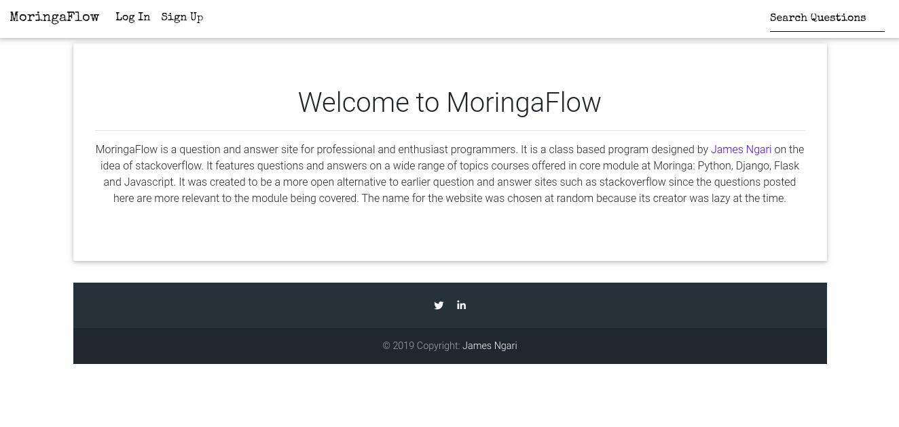
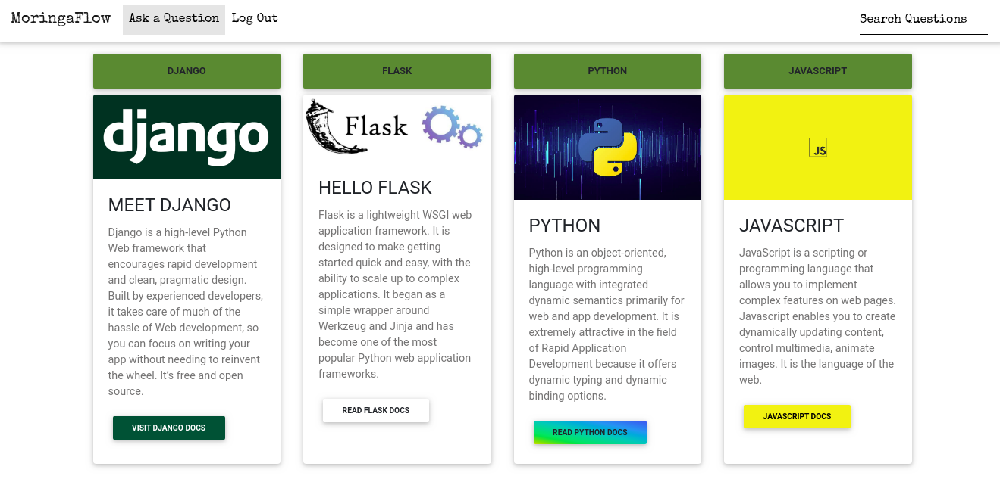
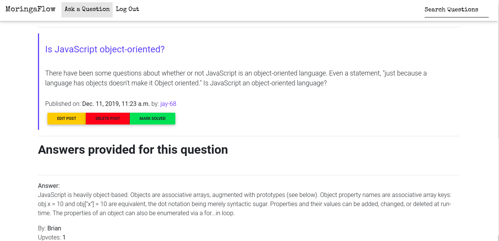

# Moringa Flow
#### Author **[James N.](https://github.com/jay-68)**

## Description
MoringaFlow is a question and answer site for professional and enthusiast programmers. It is a class based program designed by James Ngari on the idea of stackoverflow. It features questions and answers on a wide range of topics courses offered in core module at Moringa: Python, Django, Flask and Javascript. It was created to be a more open alternative to earlier question and answer sites such as stackoverflow since the questions posted here are more relevant to the module being covered. The name for the website was chosen at random because its creator was lazy at the time.








## BDD

### User stories
As a user, you will be able to:

- Log in or register as a new member
- View the main page
- Access docs for various languages from the main page
- Ask questions
- Provide answers to questions
- View profile of other users
- Vote for answers


## Live link

https://moringa68.herokuapp.com/

### Prerequsites
    - Python 3.6
    - Ubuntu software
    - Django

### Clone the Repo
Run the following command on the terminal:

`git clone https://github.com/Jay-68/moringa_flow`

Install  [Postgres](https://www.postgresql.org/download/)
 
### Create a Virtual Environment
Run the following commands in the same terminal:
`pip install virtualenv`
`python3.6 -m venv virtual`
`source virtual/bin/activate`

### Install dependencies
Install dependencies that will create an environment for the app to run
`pip3 install -r requirements`

### Create a database

```
psql

CREATE DATABASE <database_name>;

```


## Run initial Migration

```
python3.6 manage.py makemigrations
python3.6 manage.py migrate

```


### Running the app in development
In the same terminal type:
`python3 manage.py runserver`

Open the browser on `http://localhost:8000/`

## Known bugs

No known bugs. For collaboration or additions, contact me at ngari.james.n@gmail.com


## Technologies used
    - Python 3.6
    - HTML
    - Bootstrap 4
    - MDB
    - CSS
    - Django2
    - Postgresql

## Support and contact details
Contact me on ngari.james.n@gmail.com  for any comments, reviews or collaboration.

### License
MIT - Licence